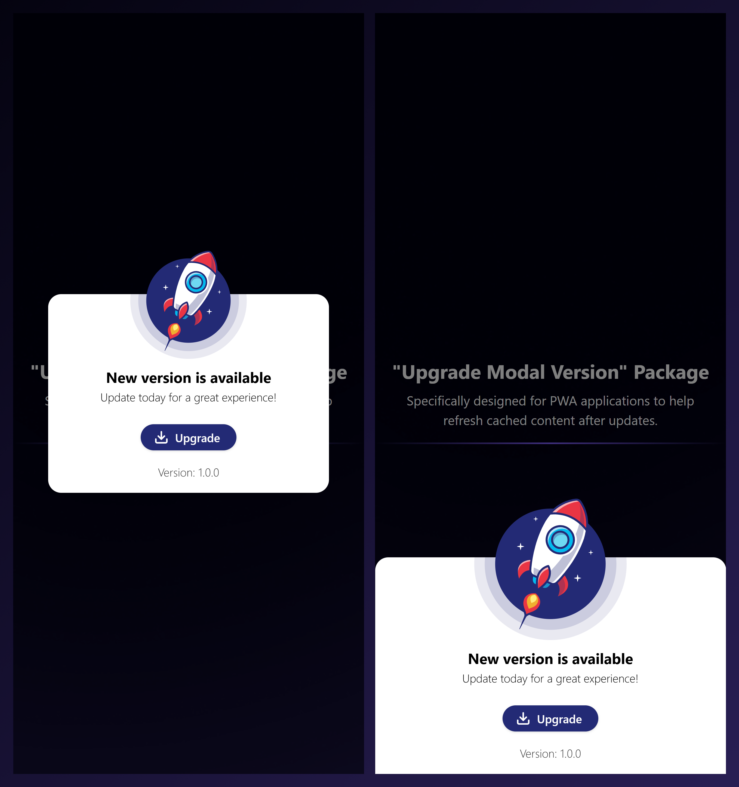

# Upgrade Modal Version

## Introduction

**Upgrade Modal Version** is a package that displays a modal whenever the version in your application's package.json changes compared to the version stored in local storage. This package is specifically designed for PWA applications to help refresh cached content after updates.

### Features

1. Compares the version in package.json with the version stored in local storage.

2. Displays a modal if the versions differ.

3. Requires the user to explicitly provide their package.json file for better control.

4. Supports highly customizable UI and behavior.

5. Provides hooks for pre-upgrade logic and error handling.

6. Seamless integration with PWA projects.

## 

## Installation

Install the SDK via npm:

```bash
npm install upgrade-modal-version
```

or yarn

```bash
yarn add upgrade-modal-version
```

## Usage

### Step 1: Add a cache-clearing function to your service worker

In your service worker file, include the following code to handle cache clearing when the modal triggers the update:

```bash
self.addEventListener('message', (event) => {
  if (event.data && event.data.type === 'CLEAR_CACHE') {
    caches.keys().then((cacheNames) => {
      cacheNames.forEach((cacheName) => {
        caches.delete(cacheName);
      });
    });
  }
});
```

### Step 2: Add the Modal to Your Application

Import and provide your package.json to the UpgradeModal component:

```tsx
import UpgradeVersionModal from "@frontend/upgrade-modal-version";
import '@frontend/upgrade-modal-version/dist/style.css'
import yourPackageJS from '../package.json';


function App() {
  return (
    <div>
      <UpgradeVersionModal packageJson={yourPackageJS} />
    </div>
  );
}
```

## Customization

You can customize the modal using the following type:

```ts
type UpgradeVersionModalProps = {
  packageJson: PackageJson;
  type?: "modal" | "popup";
  render?: {
    header?: JSX.Element;
    version?: (target: string, current?: string) => JSX.Element;
    button?: (loading: boolean, upgrade: () => Promise<void>) => JSX.Element;
    rocket?: {
      projectionModifier?: string;
      color?: string;
    };
  };
  containerClassName?: string;
  modalClassName?: string;
  onBeforeUpgrade?: () => void;
};
```

## Example

```tsx
import UpgradeVersionModal from "@frontend/upgrade-modal-version";
import '@frontend/upgrade-modal-version/dist/style.css'
import yourPackageJS from '../package.json';

function App() {
  return (
    <div>
      <UpgradeVersionModal
        packageJson={yourPackageJS}
        type="popup"
        render={{
          header: <h1>Upgrade Available</h1>,
          version: (target, current) => (
            <p>
              New version: {target}, Current version: {current}
            </p>
          ),
          button: (loading, upgrade) =>
            loading ? (
              <button disabled>Updating...</button>
            ) : (
              <button onClick={upgrade}>Update</button>
            ),
          rocket: { projectionModifier: "1.5rem", color: "red" },
        }}
        containerClassName="custom-container"
        modalClassName="custom-modal"
        onBeforeUpgrade={() => console.log("Preparing for upgrade...")}
      />
    </div>
  )
}
```

## License

ISC Licensed. Copyright (c) Esollabs 2024.
